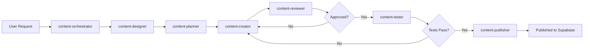

# Agent System Documentation

**Version**: 1.0.0
**Last Updated**: 2025-11-24
**Total Agents**: 39 agent definitions

Welcome to the comprehensive agent system for the Learning Platform. This system provides complete automation for both content creation (learning paths) and platform development (SDLC).

---

## 📚 Quick Start

### Creating Learning Content
```
Invoke: content-orchestrator
Example: "Create a Spanish verb conjugation learning path"
```

### Platform Development
```
Invoke: platform-orchestrator
Example: "Implement issue #123" or "Deploy to production"
```

---

## 🏗️ Architecture Overview

The system is organized into **two main streams**:

### 1. Content Stream (`content-*`)
For creating educational content, learning paths, and tasks.

**Orchestrator**: `content-orchestrator`
**Workflow**: Design → Plan → Create → Review → Test → Publish

### 2. Platform Stream (`platform-*`)
For software development lifecycle automation.

**Orchestrator**: `platform-orchestrator`
**Sub-Orchestrators**:
- Documentation
- Planning & Requirements
- Development
- Testing
- Review
- Deployment

---

## 📂 Directory Structure

```
.claude/agents/
├── AGENT_ARCHITECTURE.md    # Complete architecture design
├── AGENT_REGISTRY.md         # Registry of all agents
├── README.md                 # This file
│
├── content/                  # Content Stream
│   ├── orchestrators/
│   │   └── content-orchestrator.md
│   └── agents/
│       ├── content-designer.md
│       ├── content-planner.md
│       ├── content-creator.md
│       ├── content-reviewer.md
│       ├── content-tester.md
│       └── content-publisher.md
│
└── platform/                 # Platform Stream
    ├── orchestrators/
    │   ├── platform-orchestrator.md          # Master
    │   ├── platform-docs-orchestrator.md
    │   ├── platform-planning-orchestrator.md
    │   ├── platform-dev-orchestrator.md
    │   ├── platform-test-orchestrator.md
    │   ├── platform-review-orchestrator.md
    │   └── platform-deploy-orchestrator.md
    └── agents/
        ├── Documentation (3 agents)
        ├── Planning (4 agents)
        ├── Development (2 agents)
        ├── Testing (5 agents)
        ├── Review (4 agents)
        └── Deployment (4 agents)
```

---

## 🎯 Content Stream

### Purpose
Automate creation of high-quality educational content with built-in pedagogical review and testing.

### Agents (7 total)

1. **content-orchestrator** (Orchestrator)
   - Coordinates entire content creation workflow
   - Ensures quality gates at each phase

2. **content-designer**
   - Learning science expert
   - Applies cognitive psychology principles
   - Designs pedagogical approach

3. **content-planner**
   - Structures learning paths
   - Defines task sequences
   - Plans difficulty progression

4. **content-creator**
   - Creates actual content
   - Writes questions, answers, hints
   - Formats for database

5. **content-reviewer**
   - Reviews pedagogical quality
   - Scores content on 10 dimensions
   - Generates improvement suggestions

6. **content-tester**
   - Tests with simulated learners
   - Validates user experience
   - Checks edge cases

7. **content-publisher**
   - Deploys to Supabase
   - Verifies integrity
   - Creates backups

### Workflow Example



---

## ⚙️ Platform Stream

### Purpose
Automate complete software development lifecycle from requirements through deployment.

### Master Orchestrator

**platform-orchestrator**
- Routes tasks to appropriate sub-orchestrators
- Coordinates cross-workflow activities

### Sub-Orchestrators (6)

#### 1. Documentation Flow (`platform-docs-orchestrator`)
**Agents**: docs-architect, docs-validator, docs-publisher
**Purpose**: Create, validate, and publish documentation

#### 2. Planning & Requirements (`platform-planning-orchestrator`)
**Agents**: business-analyst, issue-planner, issue-prioritizer, product-owner
**Purpose**: Requirements gathering, planning, prioritization

#### 3. Development (`platform-dev-orchestrator`)
**Agents**: issue-implementer, implementation-tester
**Purpose**: TDD implementation and validation

#### 4. Testing (`platform-test-orchestrator`)
**Agents**: unit-tester, integration-tester, e2e-tester, performance-tester, security-tester
**Purpose**: Comprehensive testing at all levels

#### 5. Review (`platform-review-orchestrator`)
**Agents**: code-reviewer, security-auditor, ui-visual-validator, issue-generator
**Purpose**: Code review, security audit, QA, issue creation

#### 6. Deployment (`platform-deploy-orchestrator`)
**Agents**: build-pipeline-engineer, release-engineer, deployment-validator, rollback-manager
**Purpose**: Build, release, deploy, validate, rollback

### Complete Agent List (30 total)

**Documentation (3)**:
- docs-architect
- docs-validator
- docs-publisher

**Planning (4)**:
- business-analyst
- issue-planner
- issue-prioritizer
- product-owner

**Development (2)**:
- issue-implementer
- implementation-tester

**Testing (5)**:
- unit-tester
- integration-tester
- e2e-tester
- performance-tester
- security-tester

**Review (4)**:
- code-reviewer
- security-auditor
- ui-visual-validator
- issue-generator

**Deployment (4)**:
- build-pipeline-engineer
- release-engineer
- deployment-validator
- rollback-manager

**Other (8)**:
- component-library-architect
- mermaid-expert
- ui-ux-designer

---

## 🚀 Usage Examples

### Example 1: Create Learning Path
```bash
# User: "Create German irregular verbs learning path"

# System invokes: content-orchestrator
# Which then invokes in sequence:
1. content-designer → Designs approach
2. content-planner → Creates structure
3. content-creator → Generates tasks
4. content-reviewer → Reviews quality
5. content-tester → Tests functionality
6. content-publisher → Publishes to DB

# Result: New learning path live in app
```

### Example 2: Implement Feature
```bash
# User: "Implement issue #123: Add dark mode"

# System invokes: platform-orchestrator
# Routes to: platform-dev-orchestrator
# Which invokes:
1. issue-implementer → Writes code (TDD)
2. implementation-tester → Validates

# Then routes to: platform-test-orchestrator
3. unit-tester → Runs unit tests
4. integration-tester → Tests integrations
5. e2e-tester → Full user flow tests

# Then routes to: platform-review-orchestrator
6. code-reviewer → Code quality review
7. ui-visual-validator → Visual validation
8. issue-generator → Creates improvement issues

# Result: Feature implemented, tested, reviewed, ready to merge
```

### Example 3: Deploy to Production
```bash
# User: "Deploy version 2.0.0 to production"

# System invokes: platform-deploy-orchestrator
# Which invokes:
1. build-pipeline-engineer → Optimizes build
2. release-engineer → Creates release, tags
3. deployment-validator → Validates deployment
4. rollback-manager → Monitors (standby)

# Result: Version 2.0.0 live in production
```

---

## 📋 Integration with Slash Commands

Slash commands in `.claude/commands/` integrate with agents:

| Command | Invokes Agent | Purpose |
|---------|---------------|---------|
| `/new-learning-path` | content-orchestrator | Create learning content |
| `/review-learning-path` | content-reviewer | Review content quality |
| `/analyze-requirements` | business-analyst | Enhance issue requirements |
| `/plan` | issue-planner | Create implementation plan |
| `/implement` | issue-implementer | Implement feature |
| `/validate-implementation` | implementation-tester | Test implementation |
| `/create-release` | release-engineer | Create production release |
| `/deploy` | platform-deploy-orchestrator | Deploy to production |
| `/prioritize-backlog` | issue-prioritizer | Prioritize issues |

---

## 🎓 Key Concepts

### Orchestrators
Coordinate multiple specialized agents to complete complex workflows. They:
- Route tasks to appropriate agents
- Enforce quality gates
- Handle errors and retries
- Generate comprehensive reports

### Specialized Agents
Perform specific tasks with domain expertise. They:
- Have clear input/output contracts
- Use specific tools for their job
- Report status to orchestrators
- Can be invoked independently or by orchestrators

### Quality Gates
Checkpoints that must pass before proceeding:
- Content must score >= 7/10 to proceed from review
- Tests must pass before deployment
- Code review must approve before merge

### Workflows
Pre-defined sequences of agent invocations:
- Content: Design → Plan → Create → Review → Test → Publish
- Development: Implement → Test → Review → Deploy
- Testing: Unit → Integration → E2E → Performance → Security

---

## 📊 Statistics

- **Total Agent Definitions**: 39
- **Content Stream**: 1 orchestrator + 6 agents = 7
- **Platform Stream**: 1 master + 6 sub-orchestrators + 25 agents = 32
- **Total Lines**: ~20,000+ lines of detailed instructions
- **Total Documentation**: ~150 KB

---

## 🔧 How Agents Work

### Agent Definition Structure
Each agent has:
1. **Role**: What the agent does
2. **Responsibilities**: Specific duties
3. **When to Invoke**: Trigger conditions
4. **Instructions**: Step-by-step procedures
5. **Input Requirements**: What agent needs
6. **Output Format**: What agent produces
7. **Tools Available**: Tools agent can use
8. **Success Criteria**: When job is done
9. **Error Handling**: How to handle failures
10. **Examples**: Concrete usage examples

### Agent Communication
Agents communicate via:
- **Artifacts**: Files (plans, reports, code)
- **Status Updates**: To orchestrators
- **Tool Results**: From tools they use
- **GitHub Issues**: For tracking improvements

---

## 📖 Documentation Files

1. **README.md** (this file)
   - Overview and quick start
   - Usage examples
   - Integration guide

2. **AGENT_ARCHITECTURE.md**
   - Complete architecture design
   - Design decisions and rationale
   - Implementation roadmap

3. **AGENT_REGISTRY.md**
   - Complete agent catalog
   - Capabilities matrix
   - Selection guide

4. **Individual Agent Files**
   - Detailed agent instructions
   - Specific procedures
   - Tool usage guides

---

## 🎯 Best Practices

### When to Use Orchestrators
- ✅ Complex multi-step workflows
- ✅ Need quality gates
- ✅ Multiple agents involved
- ✅ Need comprehensive reporting

### When to Use Individual Agents
- ✅ Single specific task
- ✅ Already have context
- ✅ Testing agent capabilities
- ✅ Quick one-off operations

### Quality Assurance
- Always let orchestrators complete full workflow
- Don't skip quality gates
- Review agent reports
- Iterate based on feedback

### Error Handling
- Agents report errors to orchestrators
- Orchestrators decide retry/skip/abort
- All errors logged for debugging
- Users informed of issues

---

## 🚦 Workflow States

Agents and orchestrators track state:

- **pending**: Not started
- **in_progress**: Currently executing
- **completed**: Successfully finished
- **failed**: Error occurred
- **blocked**: Waiting for dependency

---

## 🔮 Future Enhancements

1. **Parallel Execution**: Run independent agents concurrently
2. **Agent Learning**: Track performance, improve over time
3. **Cost Optimization**: Use cheaper models for simple tasks
4. **Agent Marketplace**: Share custom agents
5. **Visual Workflow Builder**: GUI for creating workflows
6. **Agent Versioning**: Track agent evolution
7. **Performance Metrics**: Measure agent effectiveness
8. **Custom Agents**: User-defined specialized agents

---

## 📞 Support

### Getting Help
1. Review agent documentation
2. Check AGENT_REGISTRY.md for agent list
3. Read AGENT_ARCHITECTURE.md for design
4. Open GitHub issue with `agent` label

### Contributing
To add a new agent:
1. Create agent definition file
2. Follow existing structure
3. Add to AGENT_REGISTRY.md
4. Update orchestrator if needed
5. Add tests
6. Submit PR

---

## 📜 License

Same as main project (MIT)

---

## 🎉 Summary

This agent system provides:

✅ **Complete Content Automation**: From idea to published learning path
✅ **Full SDLC Coverage**: Requirements → Development → Testing → Review → Deployment
✅ **Quality Gates**: Ensure high quality at every step
✅ **Comprehensive Testing**: Unit, integration, E2E, performance, security
✅ **Automated Reviews**: Code, security, visual, with issue generation
✅ **Production Ready**: 37 agents, 20,000+ lines of instructions

**Start using agents today to automate your workflows!**

For detailed information, see:
- `AGENT_ARCHITECTURE.md` - Design and architecture
- `AGENT_REGISTRY.md` - Complete agent catalog
- Individual agent files - Detailed instructions
