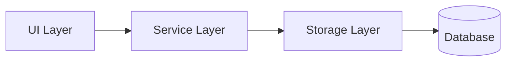
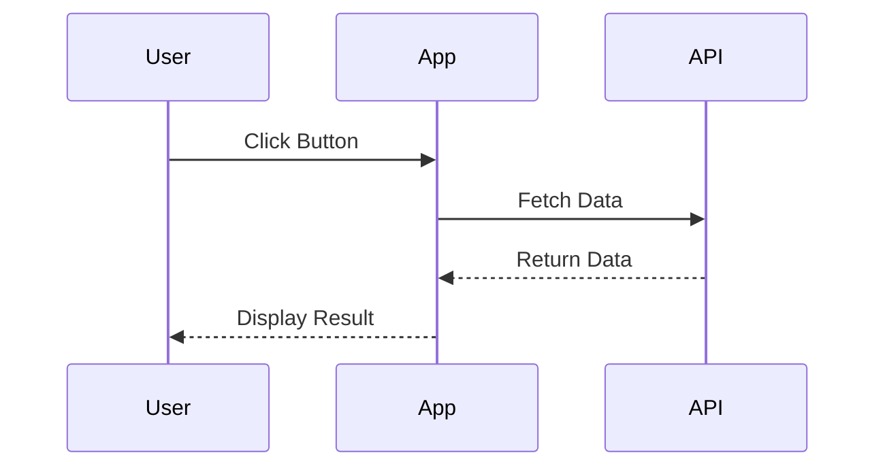

# Documentation Agent Guidelines

**Last Updated**: 2025-12-01
**Parent Guide**: [../AGENTS.md](../AGENTS.md)

> **For AI Agents**: This guide contains specific instructions for working with project documentation.

**Related Guides**: [tests/AGENTS.md](../tests/AGENTS.md) for test documentation, [templates/AGENTS.md](../templates/AGENTS.md) for code examples

---

## 🎯 Purpose

This guide provides documentation-specific guidelines for AI agents working with:
- Technical documentation
- API documentation
- User guides
- Architecture diagrams
- Screenshots and visual aids

---

## 📁 Directory Structure

```
docs/
├── AGENTS.md                        # This file
├── CSS_MODULES_MIGRATION_REPORT.md  # Migration reports
├── DEPLOYMENT.md                    # Deployment guide
├── NEW_TASK_TYPE_GUIDE.md           # Feature guides
├── TESTING_REPORT.md                # Test reports
├── css-modules.md                   # Technical guides
└── *.png                            # Documentation screenshots
```

---

## 📝 Documentation Types

### 1. **Technical Guides**
Purpose: Explain technical concepts, patterns, architectures

**Example**: `css-modules.md`

**Structure**:
```markdown
# Title

## Overview
Brief description of what this guide covers

## Prerequisites
What the reader needs to know

## Core Concepts
Main ideas explained

## Implementation
Step-by-step instructions

## Examples
Code samples with explanations

## Best Practices
Dos and don'ts

## Troubleshooting
Common issues and solutions

## Related Documentation
Links to other guides
```

### 2. **Migration Reports**
Purpose: Document major changes, migrations, refactorings

**Example**: `CSS_MODULES_MIGRATION_REPORT.md`

**Structure**:
```markdown
# Migration Report: [Feature Name]

## Summary
What changed and why

## Motivation
Reasons for the change

## Changes Made
- Detailed list of changes
- File modifications
- New patterns introduced

## Breaking Changes
What breaks and how to fix

## Migration Guide
Steps to adapt existing code

## Testing
How changes were validated

## Rollback Plan
How to revert if needed
```

### 3. **Deployment Guides**
Purpose: Instructions for deploying the application

**Example**: `DEPLOYMENT.md`

**Structure**:
```markdown
# Deployment Guide

## Prerequisites
- Required tools
- Access requirements
- Environment setup

## Deployment Process
Step-by-step deployment instructions

## Verification
How to verify successful deployment

## Rollback
How to roll back if needed

## Troubleshooting
Common deployment issues
```

### 4. **Feature Guides**
Purpose: How to implement or use specific features

**Example**: `NEW_TASK_TYPE_GUIDE.md`

**Structure**:
```markdown
# Feature Guide: [Feature Name]

## Overview
What the feature does

## When to Use
Use cases and scenarios

## Implementation
How to implement/use

## Code Examples
Working examples

## Testing
How to test the feature

## FAQ
Common questions
```

---

## 📸 Screenshot Management

### Storage Rules

**✅ DO**:
- Save to `docs/` directory
- Use descriptive filenames: `feature-name-context.png`
- Optimize images (compress before committing)
- Include captions in documentation

**❌ DON'T**:
- Save temporary screenshots here
- Use generic names like `image1.png`
- Commit unoptimized large files (>500KB)
- Save PII or sensitive data in screenshots

### Screenshot Naming Convention

```
{feature}-{context}-{variant}.png

Examples:
- admin-panel-improved-design.png
- homepage-desktop-view.png
- login-flow-error-state.png
- task-showcase-all-types.png
```

### Taking Documentation Screenshots

```bash
# Use Playwright for consistent screenshots
npx playwright screenshot \
  --viewport-size=1280,720 \
  --full-page \
  http://localhost:5173

# Or use browser DevTools
# 1. Open DevTools (F12)
# 2. Toggle device toolbar (Ctrl+Shift+M)
# 3. Set viewport size
# 4. Capture screenshot
```

### Optimizing Screenshots

```bash
# Install optimization tools
npm install -g imagemin-cli imagemin-pngquant

# Optimize PNG
imagemin docs/*.png --plugin=pngquant --out-dir=docs/

# Or use online tools:
# - TinyPNG: https://tinypng.com/
# - Squoosh: https://squoosh.app/
```

---

## ✍️ Writing Documentation

### Style Guide

**Tone**:
- Clear and concise
- Professional but friendly
- Direct and actionable

**Structure**:
- Use headers for organization (##, ###)
- Use lists for steps
- Use code blocks for examples
- Use callouts for important info

**Callouts**:
```markdown
**✅ DO**: Recommended approach
**❌ DON'T**: Avoid this
**⚠️ WARNING**: Important caution
**💡 TIP**: Helpful suggestion
**📝 NOTE**: Additional information
```

### Code Examples

```markdown
```typescript
// Always include language identifier
// Add comments to explain non-obvious code
const example = await supabase.from('topics').select('*')
\```
```

### Linking

```markdown
<!-- Internal links (relative) -->
See [CSS Modules Guide](./css-modules.md)

<!-- Parent directory -->
See [Main Guide](../AGENTS.md)

<!-- Anchor links -->
See [Prerequisites](#prerequisites)

<!-- External links -->
See [Supabase Docs](https://supabase.com/docs)
```

---

## 🔄 Updating Documentation

### When to Update

**Always update when**:
- Architecture changes
- New features added
- Breaking changes introduced
- Best practices evolve
- Common issues discovered

### Update Checklist

- [ ] Update relevant guide
- [ ] Update related links
- [ ] Check for broken links
- [ ] Update screenshots if needed
- [ ] Update last modified date
- [ ] Review for accuracy

### Deprecation Notice

When marking something as deprecated:

```markdown
## Old Feature (Deprecated)

**⚠️ DEPRECATED**: This feature is deprecated as of 2025-11-24. Use [New Feature](#new-feature) instead.

**Migration Guide**: [Link to migration guide]

**Removal Date**: Planned for 2026-01-01
```

---

## 📊 Documentation Standards

### Required Sections

All documentation must include:
- [ ] Title
- [ ] Last Updated date
- [ ] Overview/Purpose
- [ ] Table of Contents (for long docs)
- [ ] Related Documentation links

### File Naming

```
# Use SCREAMING_SNAKE_CASE for reports/status
CSS_MODULES_MIGRATION_REPORT.md
DEPLOYMENT.md
TESTING_REPORT.md

# Use kebab-case for guides
css-modules.md
new-task-type-guide.md
api-reference.md
```

### Markdown Standards

- Use ATX headers (`#`, `##`, `###`)
- Use fenced code blocks with language identifiers
- Use relative links for internal docs
- Include alt text for images
- Use tables for structured data
- Use horizontal rules (`---`) to separate sections

---

## 🔍 Documentation Review

### Self-Review Checklist

Before committing documentation:

- [ ] Spelling and grammar checked
- [ ] Code examples tested
- [ ] Links work correctly
- [ ] Screenshots are clear and relevant
- [ ] Follows style guide
- [ ] Appropriate level of detail
- [ ] No sensitive information
- [ ] Cross-references updated

### Getting Feedback

```bash
# Use docs-validator agent
# (invoked via platform-docs-orchestrator)

# Or create PR for review
gh pr create --title "docs: Update CSS Modules guide" --body "Updates..."
```

---

## 🚨 Common Mistakes

### ❌ DON'T

```markdown
<!-- Vague titles -->
# Guide

<!-- Broken links -->
See [Link](./missing.md)

<!-- No code language -->
\```
const code = true
\```

<!-- Hardcoded dates -->
Last updated: January 24th

<!-- Missing context -->
Run the command to fix it.
```

### ✅ DO

```markdown
<!-- Clear titles -->
# CSS Modules Migration Guide

<!-- Working links -->
See [CSS Guide](./css-modules.md)

<!-- Language specified -->
\```typescript
const code: boolean = true
\```

<!-- ISO date format -->
**Last Updated**: 2025-11-24

<!-- Clear instructions -->
Run `npm run build` to verify changes compile correctly.
```

---

## 📚 Related Documentation

- **Parent Guide**: [../AGENTS.md](../AGENTS.md)
- **Testing Docs**: [../tests/AGENTS.md](../tests/AGENTS.md)
- **Template Docs**: [../templates/AGENTS.md](../templates/AGENTS.md)
- **Supabase Docs**: [../supabase/AGENTS.md](../supabase/AGENTS.md)

---

## 🎯 Agent Commands

```bash
# Serve docs locally (if using MkDocs or similar)
# (Currently, just open in editor or GitHub)

# Check for broken links
npx markdown-link-check docs/*.md

# Lint markdown
npx markdownlint docs/*.md

# Generate table of contents
npx markdown-toc -i docs/README.md
```

---

## 🎨 Visual Documentation

### Diagrams

Use Mermaid for diagrams (supported by GitHub):

```markdown
\```mermaid
graph TD
    A[Start] --> B[Process]
    B --> C[End]
\```
```

### Architecture Diagrams



### Sequence Diagrams



---

**Maintained By**: docs-architect, docs-validator
**Questions?**: See [../AGENTS.md](../AGENTS.md) or open GitHub issue with `documentation` label
