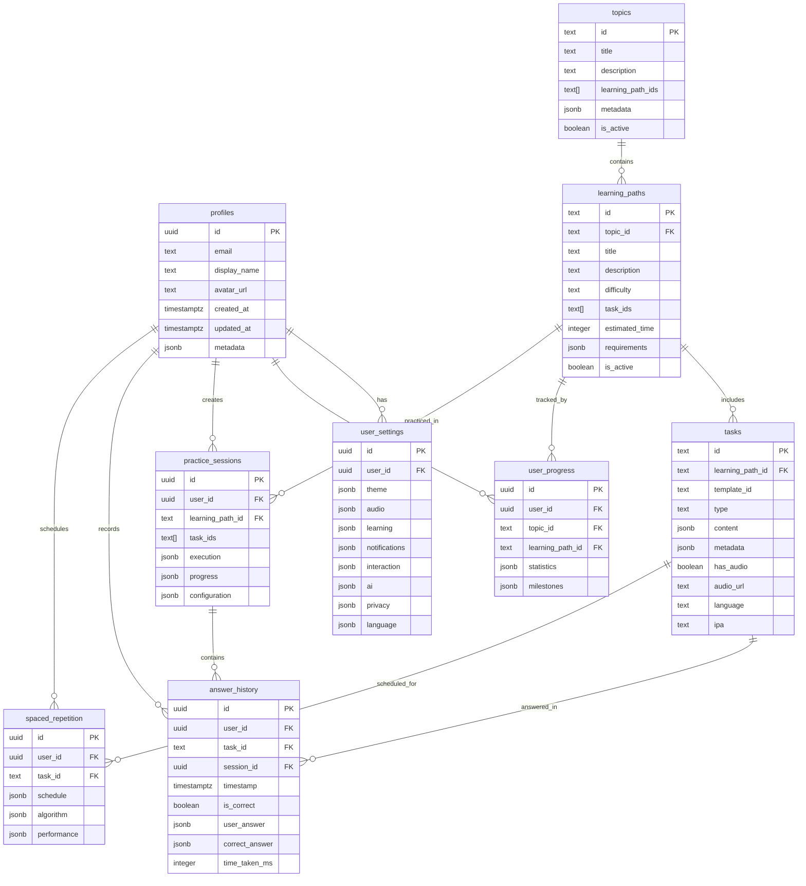

# Database Schema Documentation

**Last Updated**: 2025-11-24
**Database**: Supabase PostgreSQL
**Schema Version**: 20250123000001

## Overview

The MindForge Academy learning platform uses a relational database architecture with 9 main tables organized into three logical groups:

1. **User Management** - Profiles and settings
2. **Learning Content** - Topics, learning paths, and tasks
3. **User Progress** - Progress tracking, sessions, answers, and spaced repetition

All tables use Row Level Security (RLS) for multi-user data isolation. See [ROW_LEVEL_SECURITY.md](./ROW_LEVEL_SECURITY.md) for security policies.

## Entity Relationship Diagram



## Tables

### 1. User Management

#### profiles

Extends Supabase's `auth.users` with additional user information.

| Column | Type | Constraints | Description |
|--------|------|-------------|-------------|
| id | UUID | PRIMARY KEY, REFERENCES auth.users(id) ON DELETE CASCADE | User ID from Supabase Auth |
| email | TEXT | NOT NULL | User's email address |
| display_name | TEXT | | Display name for UI |
| avatar_url | TEXT | | URL to user's avatar image |
| created_at | TIMESTAMPTZ | NOT NULL, DEFAULT NOW() | Account creation timestamp |
| updated_at | TIMESTAMPTZ | NOT NULL, DEFAULT NOW() | Last profile update timestamp |
| metadata | JSONB | DEFAULT '{}' | Additional user metadata |

**Triggers:**
- Automatically created when user signs up (via `on_auth_user_created` trigger)
- Auto-updates `updated_at` on modifications

**Indexes:**
- Primary key on `id`

---

#### user_settings

Stores all user preferences and configuration.

| Column | Type | Constraints | Description |
|--------|------|-------------|-------------|
| id | UUID | PRIMARY KEY, DEFAULT uuid_generate_v4() | Settings ID |
| user_id | UUID | NOT NULL, UNIQUE, REFERENCES profiles(id) ON DELETE CASCADE | Owner user ID |
| theme | JSONB | DEFAULT {...} | Theme preferences (mode, fontScale, animations, reducedMotion) |
| audio | JSONB | DEFAULT {...} | Audio settings (autoPlay, volume, soundEffects, playbackRate) |
| learning | JSONB | DEFAULT {...} | Learning preferences (algorithm, dailyGoal, sessionSize, randomizeOrder) |
| notifications | JSONB | DEFAULT {...} | Notification settings (dailyReminder, streakWarning, weeklyReport) |
| interaction | JSONB | DEFAULT {...} | Interaction preferences (vibrations, confetti, wakeLock, keyboardShortcuts) |
| ai | JSONB | DEFAULT {...} | AI feature settings (explanations, depth, examples, usageLimit) |
| privacy | JSONB | DEFAULT {...} | Privacy settings (dataStorage, analytics, errorReports, betaFeatures) |
| language | JSONB | DEFAULT {...} | Language settings (interfaceLanguage, timezone, dateFormat) |
| created_at | TIMESTAMPTZ | NOT NULL, DEFAULT NOW() | Settings creation timestamp |
| updated_at | TIMESTAMPTZ | NOT NULL, DEFAULT NOW() | Last settings update |

**JSONB Structure Examples:**

```json
// theme
{
  "mode": "system",
  "fontScale": 1.0,
  "animationsEnabled": true,
  "reducedMotion": false
}

// audio
{
  "autoPlayEnabled": true,
  "autoPlayRepeats": 2,
  "autoPlayDelayMs": 800,
  "soundEffectsEnabled": true,
  "soundEffectsVolume": 0.7,
  "successChimeEnabled": true,
  "playbackRate": 1.0
}

// learning
{
  "algorithm": "adaptive",
  "dailyGoal": 20,
  "sessionSize": 10,
  "repeatDifficultTasks": true,
  "randomizeOrder": true
}
```

**Indexes:**
- Primary key on `id`
- Unique constraint on `user_id`

---

### 2. Learning Content

#### topics

Top-level subject areas (e.g., Mathematics, Biology, English).

| Column | Type | Constraints | Description |
|--------|------|-------------|-------------|
| id | TEXT | PRIMARY KEY | Topic identifier (e.g., "math", "biology") |
| title | TEXT | NOT NULL | Display title |
| description | TEXT | NOT NULL | Topic description |
| learning_path_ids | TEXT[] | DEFAULT ARRAY[]::TEXT[] | Array of learning path IDs in this topic |
| metadata | JSONB | DEFAULT '{}' | Additional topic metadata |
| is_active | BOOLEAN | DEFAULT true | Whether topic is active/visible |
| created_at | TIMESTAMPTZ | NOT NULL, DEFAULT NOW() | Topic creation timestamp |
| updated_at | TIMESTAMPTZ | NOT NULL, DEFAULT NOW() | Last topic update |

**Indexes:**
- Primary key on `id`

**Example:**
```json
{
  "id": "math",
  "title": "Mathematik",
  "description": "Mathematische Grundlagen und Konzepte",
  "learning_path_ids": ["math-basics", "math-algebra"],
  "is_active": true
}
```

---

#### learning_paths

Collections of related tasks within a topic.

| Column | Type | Constraints | Description |
|--------|------|-------------|-------------|
| id | TEXT | PRIMARY KEY | Learning path identifier |
| topic_id | TEXT | NOT NULL, REFERENCES topics(id) ON DELETE CASCADE | Parent topic |
| title | TEXT | NOT NULL | Display title |
| description | TEXT | NOT NULL | Learning path description |
| difficulty | TEXT | NOT NULL, CHECK (difficulty IN ('easy', 'medium', 'hard')) | Difficulty level |
| task_ids | TEXT[] | DEFAULT ARRAY[]::TEXT[] | Ordered array of task IDs |
| estimated_time | INTEGER | NOT NULL, DEFAULT 30 | Estimated completion time (minutes) |
| requirements | JSONB | DEFAULT {...} | Completion requirements |
| is_active | BOOLEAN | DEFAULT true | Whether learning path is active |
| created_at | TIMESTAMPTZ | NOT NULL, DEFAULT NOW() | Creation timestamp |
| updated_at | TIMESTAMPTZ | NOT NULL, DEFAULT NOW() | Last update timestamp |

**JSONB Structure - requirements:**
```json
{
  "minimumAccuracy": 70,
  "requiredTasks": 10
}
```

**Indexes:**
- Primary key on `id`
- `idx_learning_paths_topic_id` on `topic_id`
- `idx_learning_paths_difficulty` on `difficulty`
- `idx_learning_paths_is_active` on `is_active`

---

#### tasks

Individual learning items (questions, exercises).

| Column | Type | Constraints | Description |
|--------|------|-------------|-------------|
| id | TEXT | PRIMARY KEY | Task identifier |
| learning_path_id | TEXT | NOT NULL, REFERENCES learning_paths(id) ON DELETE CASCADE | Parent learning path |
| template_id | TEXT | | Template used to generate task (if applicable) |
| type | TEXT | NOT NULL, CHECK (type IN (...)) | Task type (see Task Types below) |
| content | JSONB | NOT NULL | Task content (question, options, answer) |
| metadata | JSONB | DEFAULT {...} | Task metadata |
| has_audio | BOOLEAN | DEFAULT false | Whether task has audio |
| audio_url | TEXT | | URL to audio file |
| language | TEXT | | Language code (e.g., "de", "en") |
| ipa | TEXT | | International Phonetic Alphabet transcription |
| created_at | TIMESTAMPTZ | NOT NULL, DEFAULT NOW() | Task creation timestamp |
| updated_at | TIMESTAMPTZ | NOT NULL, DEFAULT NOW() | Last task update |

**Task Types:**
- `multiple-choice` - Single correct answer from options
- `cloze-deletion` - Fill in the blanks
- `true-false` - Boolean evaluation
- `ordering` - Sort items in correct sequence
- `matching` - Match pairs between columns
- `multiple-select` - Multiple correct answers
- `slider` - Numeric answer with tolerance
- `word-scramble` - Unscramble letters
- `flashcard` - Front/back card
- `text-input` - Free text answer

**JSONB Structure - content (example for multiple-choice):**
```json
{
  "question": "Was ist 2 + 2?",
  "options": ["3", "4", "5", "6"],
  "correctAnswer": 1
}
```

**JSONB Structure - metadata:**
```json
{
  "difficulty": "medium",
  "tags": ["grundrechenarten", "addition"],
  "estimatedTime": 60,
  "points": 10
}
```

**Indexes:**
- Primary key on `id`
- `idx_tasks_learning_path_id` on `learning_path_id`
- `idx_tasks_type` on `type`
- `idx_tasks_has_audio` on `has_audio`
- `idx_tasks_metadata_difficulty` on `(metadata->>'difficulty')`

---

### 3. User Progress & Tracking

#### user_progress

Tracks user progress for each learning path.

| Column | Type | Constraints | Description |
|--------|------|-------------|-------------|
| id | UUID | PRIMARY KEY, DEFAULT uuid_generate_v4() | Progress record ID |
| user_id | UUID | NOT NULL, REFERENCES profiles(id) ON DELETE CASCADE | User ID |
| topic_id | TEXT | NOT NULL, REFERENCES topics(id) ON DELETE CASCADE | Topic ID |
| learning_path_id | TEXT | NOT NULL, REFERENCES learning_paths(id) ON DELETE CASCADE | Learning path ID |
| statistics | JSONB | DEFAULT {...} | Progress statistics |
| milestones | JSONB | DEFAULT {...} | Achievement milestones |
| created_at | TIMESTAMPTZ | NOT NULL, DEFAULT NOW() | Record creation timestamp |
| updated_at | TIMESTAMPTZ | NOT NULL, DEFAULT NOW() | Last progress update |

**Unique Constraint:** `(user_id, learning_path_id)` - One progress record per user per learning path

**JSONB Structure - statistics:**
```json
{
  "tasksCompleted": 42,
  "correctAnswers": 38,
  "incorrectAnswers": 4,
  "totalTime": 3600000,
  "averageAccuracy": 90.48,
  "streak": 7
}
```

**JSONB Structure - milestones:**
```json
{
  "firstTaskCompleted": "2025-11-20T10:30:00Z",
  "lastActivity": "2025-11-24T14:22:00Z",
  "achievements": ["first_perfect", "week_streak"]
}
```

**Indexes:**
- Primary key on `id`
- `idx_user_progress_user_id` on `user_id`
- `idx_user_progress_learning_path_id` on `learning_path_id`
- `idx_user_progress_topic_id` on `topic_id`

---

#### practice_sessions

Tracks active and completed practice sessions.

| Column | Type | Constraints | Description |
|--------|------|-------------|-------------|
| id | UUID | PRIMARY KEY, DEFAULT uuid_generate_v4() | Session ID |
| user_id | UUID | NOT NULL, REFERENCES profiles(id) ON DELETE CASCADE | User ID |
| learning_path_id | TEXT | NOT NULL, REFERENCES learning_paths(id) ON DELETE CASCADE | Learning path ID |
| task_ids | TEXT[] | NOT NULL | Ordered array of task IDs in session |
| execution | JSONB | DEFAULT {...} | Session execution state |
| progress | JSONB | DEFAULT {...} | Current progress in session |
| configuration | JSONB | DEFAULT {...} | Session configuration |
| created_at | TIMESTAMPTZ | NOT NULL, DEFAULT NOW() | Session creation timestamp |
| updated_at | TIMESTAMPTZ | NOT NULL, DEFAULT NOW() | Last session update |

**JSONB Structure - execution:**
```json
{
  "status": "in_progress",
  "startedAt": "2025-11-24T14:00:00Z",
  "completedAt": null,
  "pausedAt": null
}
```

**Status Values:** `planned`, `in_progress`, `paused`, `completed`, `abandoned`

**JSONB Structure - progress:**
```json
{
  "currentTaskIndex": 3,
  "correctCount": 2,
  "incorrectCount": 1,
  "totalTasks": 10
}
```

**JSONB Structure - configuration:**
```json
{
  "targetCount": 10,
  "includeReview": true,
  "algorithm": "adaptive"
}
```

**Indexes:**
- Primary key on `id`
- `idx_practice_sessions_user_id` on `user_id`
- `idx_practice_sessions_learning_path_id` on `learning_path_id`
- `idx_practice_sessions_status` on `(execution->>'status')`
- `idx_practice_sessions_created_at` on `created_at DESC`

---

#### answer_history

Records every answer submitted by users.

| Column | Type | Constraints | Description |
|--------|------|-------------|-------------|
| id | UUID | PRIMARY KEY, DEFAULT uuid_generate_v4() | Answer record ID |
| user_id | UUID | NOT NULL, REFERENCES profiles(id) ON DELETE CASCADE | User ID |
| task_id | TEXT | NOT NULL, REFERENCES tasks(id) ON DELETE CASCADE | Task ID |
| session_id | UUID | REFERENCES practice_sessions(id) ON DELETE SET NULL | Session ID (if part of session) |
| timestamp | TIMESTAMPTZ | NOT NULL, DEFAULT NOW() | Answer submission timestamp |
| is_correct | BOOLEAN | NOT NULL | Whether answer was correct |
| user_answer | JSONB | | User's submitted answer |
| correct_answer | JSONB | | Correct answer for comparison |
| time_taken_ms | INTEGER | | Time taken to answer (milliseconds) |
| created_at | TIMESTAMPTZ | NOT NULL, DEFAULT NOW() | Record creation timestamp |

**Indexes:**
- Primary key on `id`
- `idx_answer_history_user_id` on `user_id`
- `idx_answer_history_task_id` on `task_id`
- `idx_answer_history_session_id` on `session_id`
- `idx_answer_history_timestamp` on `timestamp DESC`
- `idx_answer_history_is_correct` on `is_correct`

**Example:**
```json
{
  "user_answer": {"selected": 1},
  "correct_answer": {"selected": 1},
  "is_correct": true,
  "time_taken_ms": 2500
}
```

---

#### spaced_repetition

Manages spaced repetition scheduling using the SM-2 algorithm.

| Column | Type | Constraints | Description |
|--------|------|-------------|-------------|
| id | UUID | PRIMARY KEY, DEFAULT uuid_generate_v4() | Spaced repetition record ID |
| user_id | UUID | NOT NULL, REFERENCES profiles(id) ON DELETE CASCADE | User ID |
| task_id | TEXT | NOT NULL, REFERENCES tasks(id) ON DELETE CASCADE | Task ID |
| schedule | JSONB | DEFAULT {...} | Review scheduling data |
| algorithm | JSONB | DEFAULT {...} | SM-2 algorithm state |
| performance | JSONB | DEFAULT {...} | Performance tracking |
| created_at | TIMESTAMPTZ | NOT NULL, DEFAULT NOW() | Record creation timestamp |
| updated_at | TIMESTAMPTZ | NOT NULL, DEFAULT NOW() | Last schedule update |

**Unique Constraint:** `(user_id, task_id)` - One schedule per user per task

**JSONB Structure - schedule:**
```json
{
  "nextReview": "2025-11-27T14:00:00Z",
  "lastReviewDate": "2025-11-24T14:00:00Z"
}
```

**JSONB Structure - algorithm:**
```json
{
  "interval": 6,
  "easeFactor": 2.5,
  "repetitionCount": 2
}
```

**SM-2 Algorithm Parameters:**
- `interval`: Days until next review (1, 6, then `interval × easeFactor`)
- `easeFactor`: Difficulty rating (1.3 to 2.5)
- `repetitionCount`: Number of successful reviews

**JSONB Structure - performance:**
```json
{
  "reviewCount": 5,
  "correctCount": 4
}
```

**Indexes:**
- Primary key on `id`
- `idx_spaced_repetition_user_id` on `user_id`
- `idx_spaced_repetition_task_id` on `task_id`
- `idx_spaced_repetition_next_review` on `(schedule->>'nextReview')`

---

## Database Functions

### get_user_progress_summary(p_user_id UUID)

Retrieves a summary of user's learning progress across all learning paths.

**Returns:**
```sql
TABLE (
  total_paths INTEGER,
  completed_paths INTEGER,
  total_tasks_completed INTEGER,
  total_correct_answers INTEGER,
  overall_accuracy NUMERIC
)
```

**Usage:**
```sql
SELECT * FROM get_user_progress_summary('user-uuid-here');
```

**Example Output:**
```
total_paths | completed_paths | total_tasks_completed | total_correct_answers | overall_accuracy
     5      |        2        |         125           |         110           |      88.00
```

---

## Triggers

### Auto-Update Timestamps

All main tables have `updated_at` triggers that automatically update the timestamp on row modifications:

- `update_profiles_updated_at`
- `update_user_settings_updated_at`
- `update_topics_updated_at`
- `update_learning_paths_updated_at`
- `update_tasks_updated_at`
- `update_user_progress_updated_at`
- `update_practice_sessions_updated_at`
- `update_spaced_repetition_updated_at`

### Auto-Create Profile

The `on_auth_user_created` trigger automatically creates a profile record when a new user signs up via Supabase Auth.

---

## Data Types and Constraints

### Text vs UUID IDs

- **UUID**: Used for user-generated records (`profiles`, `user_progress`, `practice_sessions`, etc.)
- **TEXT**: Used for content records with semantic IDs (`topics`, `learning_paths`, `tasks`)

### JSONB Usage

JSONB is used extensively for flexible, schema-less data that may evolve over time:
- User settings and preferences
- Task content and metadata
- Progress statistics
- Session state

**Benefits:**
- Flexible schema evolution
- No migrations for new settings
- Efficient indexing with GIN indexes
- JSON functions for querying

### Array Types

`TEXT[]` arrays are used for:
- `topics.learning_path_ids` - Ordered list of learning paths
- `learning_paths.task_ids` - Ordered list of tasks
- `practice_sessions.task_ids` - Ordered session task list

---

## Common Queries

### Get all tasks for a learning path
```sql
SELECT * FROM tasks
WHERE learning_path_id = 'math-basics'
ORDER BY created_at;
```

### Get user's active sessions
```sql
SELECT * FROM practice_sessions
WHERE user_id = auth.uid()
  AND (execution->>'status') = 'in_progress'
ORDER BY created_at DESC;
```

### Get tasks due for review
```sql
SELECT t.*, sr.schedule
FROM tasks t
JOIN spaced_repetition sr ON t.id = sr.task_id
WHERE sr.user_id = auth.uid()
  AND (sr.schedule->>'nextReview')::timestamptz <= NOW()
ORDER BY (sr.schedule->>'nextReview')::timestamptz;
```

### Get user's learning path progress
```sql
SELECT
  lp.title,
  (up.statistics->>'tasksCompleted')::int as completed,
  (up.statistics->>'averageAccuracy')::numeric as accuracy
FROM user_progress up
JOIN learning_paths lp ON up.learning_path_id = lp.id
WHERE up.user_id = auth.uid()
ORDER BY up.updated_at DESC;
```

### Get recent answer history with task details
```sql
SELECT
  ah.timestamp,
  ah.is_correct,
  ah.time_taken_ms,
  t.type,
  t.content->>'question' as question
FROM answer_history ah
JOIN tasks t ON ah.task_id = t.id
WHERE ah.user_id = auth.uid()
ORDER BY ah.timestamp DESC
LIMIT 20;
```

---

## Performance Considerations

### Indexes

The schema includes comprehensive indexes for:
- Foreign key relationships (user_id, task_id, etc.)
- Frequently queried fields (is_correct, timestamp, status)
- JSONB fields (difficulty, status, nextReview)

### JSONB Indexing

For JSONB fields that are frequently queried, functional indexes are created:
```sql
CREATE INDEX idx_tasks_metadata_difficulty
  ON tasks((metadata->>'difficulty'));
```

### Query Optimization Tips

1. **Use indexes**: Most foreign keys and common filters are indexed
2. **JSONB operators**: Use `->` for object access, `->>` for text extraction
3. **Array operations**: Use `ANY()` or `= ALL()` for array queries
4. **Timestamp filters**: Use indexes on timestamp columns for date ranges
5. **RLS policies**: Policies use `auth.uid()` which is indexed

---

## Migration and Seeding

### Apply Schema

The schema is stored in:
```
infrastructure/supabase/migrations/20250123000001_initial_schema.sql
```

See [SETUP_SUPABASE.md](../SETUP_SUPABASE.md) for setup instructions.

### Seeding Data

Use the seeding script:
```bash
npm run seed:supabase
```

This populates:
- Topics (Math, Biology, English, Spanish)
- Learning paths for each topic
- Sample tasks for each learning path

---

## Next Steps

- Review [ROW_LEVEL_SECURITY.md](./ROW_LEVEL_SECURITY.md) for security policies
- See [SETUP_SUPABASE.md](../SETUP_SUPABASE.md) for setup guide
- Check [CONTRIBUTING.md](../CONTRIBUTING.md) for development guidelines
