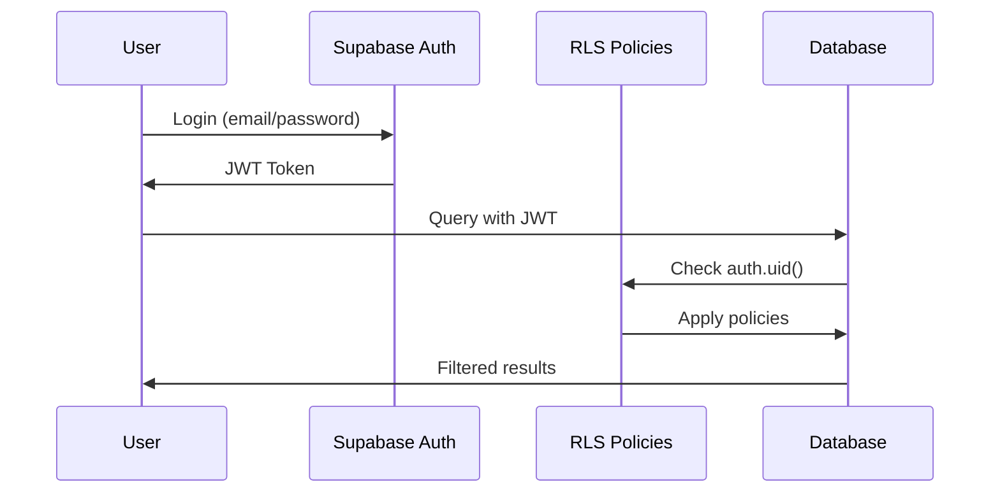
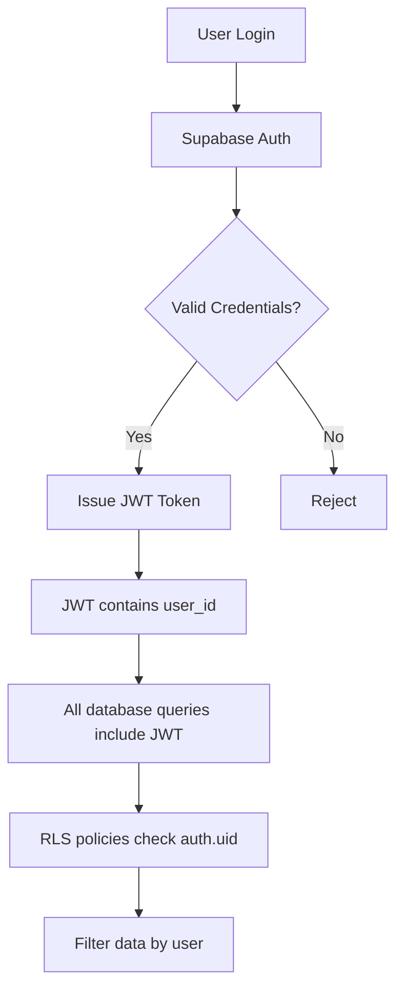

# Row Level Security (RLS) Documentation

**Last Updated**: 2025-11-24
**Database**: Supabase PostgreSQL
**Schema Version**: 20250123000001

## Overview

MindForge Academy implements comprehensive Row Level Security (RLS) to ensure multi-user data isolation and security. Every table has RLS enabled with specific policies that control who can read, insert, update, and delete data.

## Security Model

### Core Principles

1. **User Data Isolation**: Users can only access their own progress, sessions, answers, and settings
2. **Public Content**: Learning content (topics, paths, tasks) is readable by all authenticated users
3. **Admin-Only Writes**: Only administrators can create/modify learning content
4. **Automatic User Context**: Policies use `auth.uid()` to automatically identify the current user

### Authentication Flow



### Data Access Matrix

| Table | SELECT | INSERT | UPDATE | DELETE | RLS Policy |
|-------|--------|--------|--------|--------|------------|
| profiles | ✓ All | ✓ Own | ✓ Own | ✗ | Users see all profiles, manage own |
| user_settings | ✓ Own | ✓ Own | ✓ Own | ✓ Own | Complete user control over own settings |
| topics | ✓ All | ✗ | ✗ | ✗ | Public read-only |
| learning_paths | ✓ All | ✗ | ✗ | ✗ | Public read-only |
| tasks | ✓ All | ✗ | ✗ | ✗ | Public read-only |
| user_progress | ✓ Own | ✓ Own | ✓ Own | ✓ Own | Complete user control over own progress |
| practice_sessions | ✓ Own | ✓ Own | ✓ Own | ✓ Own | Complete user control over own sessions |
| answer_history | ✓ Own | ✓ Own | ✗ | ✗ | Users can view/add, not modify history |
| spaced_repetition | ✓ Own | ✓ Own | ✓ Own | ✓ Own | Complete user control over own schedules |

---

## RLS Policies by Table

### 1. profiles

**Purpose**: User profile information extending Supabase auth.users

#### Policy: "Public profiles are viewable by everyone"
```sql
CREATE POLICY "Public profiles are viewable by everyone"
  ON profiles FOR SELECT
  USING (true);
```

**Explanation**: All authenticated users can view all profiles. This enables features like leaderboards, user search, and social features.

**Security Note**: Only store non-sensitive information in profiles. Sensitive data should go in user_settings with stricter policies.

#### Policy: "Users can insert their own profile"
```sql
CREATE POLICY "Users can insert their own profile"
  ON profiles FOR INSERT
  WITH CHECK (auth.uid() = id);
```

**Explanation**: Users can only create their own profile record. The `id` must match their auth user ID.

**Trigger Protection**: The `on_auth_user_created` trigger automatically creates profiles, so manual inserts are rare.

#### Policy: "Users can update their own profile"
```sql
CREATE POLICY "Users can update their own profile"
  ON profiles FOR UPDATE
  USING (auth.uid() = id);
```

**Explanation**: Users can only modify their own profile data (display_name, avatar_url, metadata).

**Example Query:**
```sql
-- ✅ Allowed: Update own profile
UPDATE profiles
SET display_name = 'New Name'
WHERE id = auth.uid();

-- ❌ Blocked: Update another user's profile
UPDATE profiles
SET display_name = 'Hacker'
WHERE id = 'other-user-id';
```

---

### 2. user_settings

**Purpose**: User preferences and configuration

All policies use `auth.uid() = user_id` to ensure users only access their own settings.

#### Policies

```sql
CREATE POLICY "Users can view their own settings"
  ON user_settings FOR SELECT
  USING (auth.uid() = user_id);

CREATE POLICY "Users can insert their own settings"
  ON user_settings FOR INSERT
  WITH CHECK (auth.uid() = user_id);

CREATE POLICY "Users can update their own settings"
  ON user_settings FOR UPDATE
  USING (auth.uid() = user_id);

CREATE POLICY "Users can delete their own settings"
  ON user_settings FOR DELETE
  USING (auth.uid() = user_id);
```

**Isolation Level**: Complete user isolation. Users cannot see or modify other users' settings.

**Privacy Guarantee**: Ensures privacy-sensitive settings (dataStorageMode, analyticsEnabled, etc.) are completely isolated.

**Example Queries:**
```sql
-- ✅ Allowed: Get own settings
SELECT * FROM user_settings WHERE user_id = auth.uid();

-- ❌ Blocked: Query returns no rows
SELECT * FROM user_settings WHERE user_id = 'other-user-id';

-- ✅ Allowed: Update own settings
UPDATE user_settings
SET theme = '{"mode": "dark"}'::jsonb
WHERE user_id = auth.uid();
```

---

### 3. topics

**Purpose**: Subject areas (Math, Biology, etc.)

#### Policy: "Topics are viewable by everyone"
```sql
CREATE POLICY "Topics are viewable by everyone"
  ON topics FOR SELECT
  USING (true);
```

**Explanation**: All authenticated users can read topics. No INSERT, UPDATE, or DELETE policies exist - these operations are admin-only through service role or direct database access.

**Content Management**:
- Add topics via Supabase dashboard or migration scripts
- Use `is_active` flag to hide topics without deleting them

**Example Queries:**
```sql
-- ✅ Allowed: Read all active topics
SELECT * FROM topics WHERE is_active = true;

-- ❌ Blocked: No policy exists
INSERT INTO topics (id, title, description) VALUES (...);
```

---

### 4. learning_paths

**Purpose**: Collections of tasks within topics

#### Policy: "Learning paths are viewable by everyone"
```sql
CREATE POLICY "Learning paths are viewable by everyone"
  ON learning_paths FOR SELECT
  USING (true);
```

**Explanation**: All authenticated users can read learning paths. Content management is admin-only.

**Access Control**: Use `is_active` flag to control visibility without modifying RLS policies.

**Example Queries:**
```sql
-- ✅ Allowed: Get all learning paths for a topic
SELECT * FROM learning_paths
WHERE topic_id = 'math' AND is_active = true;

-- ❌ Blocked: No INSERT policy
INSERT INTO learning_paths (...) VALUES (...);
```

---

### 5. tasks

**Purpose**: Individual learning items (questions, exercises)

#### Policy: "Tasks are viewable by everyone"
```sql
CREATE POLICY "Tasks are viewable by everyone"
  ON tasks FOR SELECT
  USING (true);
```

**Explanation**: All authenticated users can read tasks. This enables the learning experience for all users while protecting content integrity through admin-only writes.

**Content Protection**:
- Answers stored in JSONB `content` field are visible (necessary for validation)
- Use client-side logic to hide answers until user submits response

**Example Queries:**
```sql
-- ✅ Allowed: Get tasks for a learning path
SELECT * FROM tasks WHERE learning_path_id = 'math-basics';

-- ✅ Allowed: Get specific task
SELECT * FROM tasks WHERE id = 'task-123';

-- ❌ Blocked: No UPDATE policy
UPDATE tasks SET content = '...' WHERE id = 'task-123';
```

---

### 6. user_progress

**Purpose**: Track user progress in learning paths

All policies ensure complete user isolation using `auth.uid() = user_id`.

#### Policies

```sql
CREATE POLICY "Users can view their own progress"
  ON user_progress FOR SELECT
  USING (auth.uid() = user_id);

CREATE POLICY "Users can insert their own progress"
  ON user_progress FOR INSERT
  WITH CHECK (auth.uid() = user_id);

CREATE POLICY "Users can update their own progress"
  ON user_progress FOR UPDATE
  USING (auth.uid() = user_id);

CREATE POLICY "Users can delete their own progress"
  ON user_progress FOR DELETE
  USING (auth.uid() = user_id);
```

**Isolation Guarantee**: Users cannot see other users' progress, preventing cheating and ensuring privacy.

**Example Queries:**
```sql
-- ✅ Allowed: Get own progress
SELECT * FROM user_progress
WHERE user_id = auth.uid() AND learning_path_id = 'math-basics';

-- ✅ Allowed: Update own progress
UPDATE user_progress
SET statistics = jsonb_set(statistics, '{tasksCompleted}', '10')
WHERE user_id = auth.uid() AND learning_path_id = 'math-basics';

-- ❌ Blocked: Returns no rows
SELECT * FROM user_progress WHERE user_id != auth.uid();
```

---

### 7. practice_sessions

**Purpose**: Track active and completed practice sessions

Complete user isolation with full CRUD permissions for own sessions.

#### Policies

```sql
CREATE POLICY "Users can view their own sessions"
  ON practice_sessions FOR SELECT
  USING (auth.uid() = user_id);

CREATE POLICY "Users can insert their own sessions"
  ON practice_sessions FOR INSERT
  WITH CHECK (auth.uid() = user_id);

CREATE POLICY "Users can update their own sessions"
  ON practice_sessions FOR UPDATE
  USING (auth.uid() = user_id);

CREATE POLICY "Users can delete their own sessions"
  ON practice_sessions FOR DELETE
  USING (auth.uid() = user_id);
```

**Session Management**: Users have complete control over their sessions (create, pause, resume, complete, delete).

**Example Queries:**
```sql
-- ✅ Allowed: Get active sessions
SELECT * FROM practice_sessions
WHERE user_id = auth.uid()
  AND (execution->>'status') = 'in_progress';

-- ✅ Allowed: Create new session
INSERT INTO practice_sessions (user_id, learning_path_id, task_ids, ...)
VALUES (auth.uid(), 'math-basics', ARRAY['task-1', 'task-2'], ...);

-- ❌ Blocked: Returns no rows
SELECT * FROM practice_sessions WHERE user_id = 'other-user-id';
```

---

### 8. answer_history

**Purpose**: Record every answer submitted by users

Users can view and add answers, but cannot modify history (ensures data integrity).

#### Policies

```sql
CREATE POLICY "Users can view their own answer history"
  ON answer_history FOR SELECT
  USING (auth.uid() = user_id);

CREATE POLICY "Users can insert their own answers"
  ON answer_history FOR INSERT
  WITH CHECK (auth.uid() = user_id);
```

**No UPDATE/DELETE**: Answer history is immutable to ensure accurate analytics and prevent cheating.

**Data Integrity**: Once an answer is recorded, it cannot be modified or deleted by users.

**Example Queries:**
```sql
-- ✅ Allowed: View own answer history
SELECT * FROM answer_history
WHERE user_id = auth.uid()
ORDER BY timestamp DESC
LIMIT 20;

-- ✅ Allowed: Record new answer
INSERT INTO answer_history (user_id, task_id, is_correct, user_answer, ...)
VALUES (auth.uid(), 'task-123', true, '{"answer": "4"}', ...);

-- ❌ Blocked: No UPDATE policy exists
UPDATE answer_history SET is_correct = true WHERE id = '...';
```

---

### 9. spaced_repetition

**Purpose**: Manage spaced repetition scheduling (SM-2 algorithm)

Complete user isolation with full CRUD permissions.

#### Policies

```sql
CREATE POLICY "Users can view their own spaced repetition data"
  ON spaced_repetition FOR SELECT
  USING (auth.uid() = user_id);

CREATE POLICY "Users can insert their own spaced repetition data"
  ON spaced_repetition FOR INSERT
  WITH CHECK (auth.uid() = user_id);

CREATE POLICY "Users can update their own spaced repetition data"
  ON spaced_repetition FOR UPDATE
  USING (auth.uid() = user_id);

CREATE POLICY "Users can delete their own spaced repetition data"
  ON spaced_repetition FOR DELETE
  USING (auth.uid() = user_id);
```

**Schedule Management**: Users have complete control over their review schedules.

**Example Queries:**
```sql
-- ✅ Allowed: Get tasks due for review
SELECT * FROM spaced_repetition
WHERE user_id = auth.uid()
  AND (schedule->>'nextReview')::timestamptz <= NOW();

-- ✅ Allowed: Update schedule after review
UPDATE spaced_repetition
SET schedule = jsonb_set(schedule, '{nextReview}', '"2025-11-30T14:00:00Z"'),
    algorithm = jsonb_set(algorithm, '{interval}', '6')
WHERE user_id = auth.uid() AND task_id = 'task-123';

-- ❌ Blocked: Returns no rows
SELECT * FROM spaced_repetition WHERE user_id != auth.uid();
```

---

## Security Architecture

### Authentication Layer



### Policy Evaluation

When a query is executed:

1. **Authentication**: JWT token is validated
2. **Policy Check**: RLS policies are evaluated using `auth.uid()`
3. **Query Filtering**: WHERE clause automatically added based on policy
4. **Result Return**: Only authorized data is returned

### Example: Behind the Scenes

**User Query:**
```sql
SELECT * FROM user_progress;
```

**What PostgreSQL Actually Executes:**
```sql
SELECT * FROM user_progress
WHERE user_id = auth.uid(); -- Automatically added by RLS
```

**Result**: User only sees their own progress, even though they queried all records.

---

## Multi-User Data Isolation

### Isolation Guarantees

| Data Type | Isolation Level | Rationale |
|-----------|-----------------|-----------|
| User Settings | Complete | Privacy-sensitive preferences |
| User Progress | Complete | Prevent cheating, ensure privacy |
| Practice Sessions | Complete | Personal learning state |
| Answer History | Complete | Academic integrity |
| Spaced Repetition | Complete | Personalized scheduling |
| Learning Content | Public Read | Shared educational resources |
| Profiles | Public Read | Enable social features |

### User Scenario Examples

#### Scenario 1: Two users in same learning path
```sql
-- User A (auth.uid() = 'user-a-id')
SELECT * FROM user_progress WHERE learning_path_id = 'math-basics';
-- Returns: Only user A's progress

-- User B (auth.uid() = 'user-b-id')
SELECT * FROM user_progress WHERE learning_path_id = 'math-basics';
-- Returns: Only user B's progress
```

**Result**: Complete isolation. Users cannot see each other's progress.

#### Scenario 2: Shared learning content
```sql
-- Both users can access the same tasks
SELECT * FROM tasks WHERE learning_path_id = 'math-basics';
-- Returns: Same tasks for both users

-- But they track progress separately
SELECT * FROM answer_history WHERE task_id = 'task-123';
-- User A sees only their answers
-- User B sees only their answers
```

**Result**: Content is shared, progress is isolated.

---

## Admin Operations

### Service Role Access

Supabase provides a service role key that bypasses RLS. Use this for:
- Content management (adding topics, paths, tasks)
- Data migrations
- Analytics across all users
- Admin operations

**Security Warning**: Never expose service role key in client code. Only use in:
- Backend services
- Database migrations
- Admin tools
- CI/CD pipelines

### Admin Query Examples

Using service role (bypasses RLS):

```javascript
// Service role client (backend only)
const { data } = await supabase
  .from('topics')
  .insert({ id: 'physics', title: 'Physik', description: '...' });

// View all users' progress (admin analytics)
const { data } = await supabase
  .from('user_progress')
  .select('*');
```

---

## Security Best Practices

### 1. Never Trust Client Input

Always validate data in policies and application logic:

```sql
-- ❌ Bad: Trusting client-provided user_id
INSERT INTO user_progress (user_id, ...) VALUES ($1, ...);

-- ✅ Good: Using authenticated user
INSERT INTO user_progress (user_id, ...) VALUES (auth.uid(), ...);
```

### 2. Use Policies for Authorization

Don't rely solely on application logic:

```javascript
// ❌ Bad: Application-level checks only
if (currentUserId === targetUserId) {
  await updateProgress();
}

// ✅ Good: RLS policies enforce authorization
// Even if application logic fails, RLS prevents unauthorized access
await supabase
  .from('user_progress')
  .update({ ... })
  .eq('user_id', currentUserId); // RLS double-checks
```

### 3. Test RLS Policies

Verify policies work as expected:

```sql
-- Test as different users
SET request.jwt.claims.sub = 'user-a-id';
SELECT * FROM user_progress; -- Should only see user A's data

SET request.jwt.claims.sub = 'user-b-id';
SELECT * FROM user_progress; -- Should only see user B's data
```

### 4. Monitor Policy Performance

RLS policies add overhead. Optimize with:
- Indexes on `user_id` columns
- Efficient policy conditions
- Query profiling with `EXPLAIN ANALYZE`

### 5. Document Policy Changes

When modifying policies:
1. Document the change
2. Test thoroughly
3. Consider backward compatibility
4. Update this documentation

---

## Common RLS Scenarios

### Scenario 1: User cannot see their own data

**Symptoms**: Queries return empty results even for own data

**Common Causes:**
1. Not authenticated (no JWT token)
2. RLS policy too restrictive
3. Wrong `user_id` in data

**Debugging:**
```sql
-- Check if authenticated
SELECT auth.uid(); -- Should return user ID, not null

-- Check if data exists with correct user_id
SELECT * FROM user_progress WHERE user_id = auth.uid();

-- Verify RLS is enabled
SELECT tablename, rowsecurity FROM pg_tables WHERE tablename = 'user_progress';
```

**Solution:**
```javascript
// Ensure JWT token is included in requests
const { data, error } = await supabase.auth.getSession();
if (!data.session) {
  // User not authenticated, redirect to login
}
```

---

### Scenario 2: Policy conflict errors

**Symptoms**: `new row violates row-level security policy`

**Common Causes:**
1. INSERT policy `WITH CHECK` fails
2. Trying to insert data for another user

**Example:**
```sql
-- ❌ This will fail
INSERT INTO user_progress (user_id, learning_path_id)
VALUES ('other-user-id', 'math-basics'); -- user_id doesn't match auth.uid()

-- ✅ This will succeed
INSERT INTO user_progress (user_id, learning_path_id)
VALUES (auth.uid(), 'math-basics'); -- user_id matches auth.uid()
```

**Solution**: Always use `auth.uid()` for user_id in INSERT operations.

---

### Scenario 3: Performance issues with RLS

**Symptoms**: Slow queries, high database load

**Common Causes:**
1. Missing indexes on `user_id`
2. Complex policy conditions
3. JSONB queries without indexes

**Optimization:**
```sql
-- ✅ Add index on user_id
CREATE INDEX idx_user_progress_user_id ON user_progress(user_id);

-- ✅ Add index on JSONB fields used in policies
CREATE INDEX idx_tasks_metadata_difficulty ON tasks((metadata->>'difficulty'));

-- ✅ Use EXPLAIN ANALYZE to profile queries
EXPLAIN ANALYZE
SELECT * FROM user_progress WHERE user_id = auth.uid();
```

---

### Scenario 4: Testing RLS in development

**Approach**: Create test users and verify isolation

```javascript
// Create two test users
const userA = await createTestUser('[email protected]');
const userB = await createTestUser('[email protected]');

// Login as user A
await supabase.auth.signInWithPassword({
  email: '[email protected]',
  password: 'password'
});

// Create progress as user A
await supabase.from('user_progress').insert({
  user_id: userA.id,
  learning_path_id: 'math-basics'
});

// Login as user B
await supabase.auth.signInWithPassword({
  email: '[email protected]',
  password: 'password'
});

// Verify user B cannot see user A's progress
const { data } = await supabase
  .from('user_progress')
  .select('*')
  .eq('learning_path_id', 'math-basics');

// data should be empty or only contain user B's progress
```

---

## Troubleshooting Guide

### Problem: "new row violates row-level security policy"

**Cause**: INSERT policy `WITH CHECK` condition fails

**Solution:**
1. Verify `user_id` matches `auth.uid()`
2. Check policy conditions
3. Ensure JWT token is valid

```javascript
// ❌ Wrong
await supabase.from('user_progress').insert({
  user_id: 'hardcoded-id', // Will fail
  learning_path_id: 'math-basics'
});

// ✅ Correct
const { data: { user } } = await supabase.auth.getUser();
await supabase.from('user_progress').insert({
  user_id: user.id, // Matches auth.uid()
  learning_path_id: 'math-basics'
});
```

---

### Problem: Empty results when data exists

**Cause**: RLS policy filters out data

**Solution:**
1. Verify authentication
2. Check if user_id matches auth.uid()
3. Verify RLS policies

```javascript
// Debug: Check authentication
const { data: { session } } = await supabase.auth.getSession();
console.log('User ID:', session?.user?.id);

// Debug: Check RLS
const { data, error } = await supabase
  .from('user_progress')
  .select('*');
console.log('Data:', data);
console.log('Error:', error);
```

---

### Problem: Cannot update/delete records

**Cause**: No UPDATE/DELETE policy exists

**Solution:**
1. Check if policies exist for operation
2. Verify policy conditions match
3. For answer_history: Cannot update (by design)

```sql
-- Check existing policies
SELECT schemaname, tablename, policyname, permissive, cmd
FROM pg_policies
WHERE tablename = 'answer_history';
```

---

### Problem: Performance degradation with RLS

**Cause**: Policy evaluation overhead

**Solution:**
1. Add indexes on filtered columns
2. Optimize policy conditions
3. Use query profiling

```sql
-- Profile query with RLS
EXPLAIN (ANALYZE, BUFFERS)
SELECT * FROM user_progress WHERE user_id = auth.uid();

-- Check for sequential scans (bad)
-- Look for index scans (good)
```

---

## Testing RLS Policies

### Manual Testing

```sql
-- 1. Set test user context
SET request.jwt.claims.sub = 'test-user-id';

-- 2. Test SELECT
SELECT * FROM user_progress;
-- Should only return test-user-id's data

-- 3. Test INSERT
INSERT INTO user_progress (user_id, learning_path_id)
VALUES ('test-user-id', 'math-basics'); -- Should succeed

INSERT INTO user_progress (user_id, learning_path_id)
VALUES ('other-user-id', 'math-basics'); -- Should fail

-- 4. Test UPDATE
UPDATE user_progress
SET statistics = '...'
WHERE user_id = 'test-user-id'; -- Should succeed

UPDATE user_progress
SET statistics = '...'
WHERE user_id = 'other-user-id'; -- Should affect 0 rows
```

### Automated Testing

```javascript
import { describe, it, expect } from 'vitest';
import { createClient } from '@supabase/supabase-js';

describe('RLS Policies', () => {
  it('should isolate user progress', async () => {
    // Create client for user A
    const clientA = createClient(url, anonKey);
    await clientA.auth.signInWithPassword({ email: 'a@test.com', password: 'password' });

    // Create client for user B
    const clientB = createClient(url, anonKey);
    await clientB.auth.signInWithPassword({ email: 'b@test.com', password: 'password' });

    // User A creates progress
    await clientA.from('user_progress').insert({
      user_id: (await clientA.auth.getUser()).data.user.id,
      learning_path_id: 'math-basics'
    });

    // User B should not see user A's progress
    const { data } = await clientB
      .from('user_progress')
      .select('*')
      .eq('learning_path_id', 'math-basics');

    expect(data).toHaveLength(0);
  });
});
```

---

## Future Enhancements

### Planned Features

1. **Role-Based Access Control (RBAC)**
   - Add `roles` table with admin, teacher, student roles
   - Policies based on roles for content management

2. **Team/Class Support**
   - Add `teams` table for classes/groups
   - Shared progress visibility within teams
   - Teacher-student relationships

3. **Audit Logging**
   - Track all data modifications
   - Admin oversight for sensitive operations

4. **Rate Limiting**
   - Prevent abuse with rate limiting policies
   - Limit API calls per user per timeframe

---

## Related Documentation

- [DATABASE_SCHEMA.md](./DATABASE_SCHEMA.md) - Complete database schema
- [SETUP_SUPABASE.md](../SETUP_SUPABASE.md) - Setup and migration guide
- [CONTRIBUTING.md](../CONTRIBUTING.md) - Development guidelines
- [Supabase RLS Documentation](https://supabase.com/docs/guides/auth/row-level-security)

---

## Security Contact

If you discover a security vulnerability, please:
1. Do NOT open a public issue
2. Email: [Add security email]
3. Include detailed description and steps to reproduce
