# Automated Supabase Seeding

**Last Updated**: 2025-11-24

## Overview

The learning platform automatically syncs learning path data to Supabase whenever JSON files in `public/learning-paths/` are modified and pushed to the `main` branch. This ensures the database always stays in sync with the content files.

## How It Works

### Automatic Sync

The GitHub Actions workflow `.github/workflows/sync-supabase.yml` automatically triggers when:

1. **Content Changes**: Any JSON file in `public/learning-paths/` is modified
2. **Seed Script Changes**: The `scripts/seed-supabase.ts` file is updated
3. **Manual Trigger**: Workflow is manually triggered from GitHub UI

### Workflow Steps

```mermaid
graph LR
    A[Push to main] --> B{Learning paths<br/>modified?}
    B -->|Yes| C[Trigger Workflow]
    B -->|No| D[Skip]
    C --> E[Install Dependencies]
    E --> F[Run seed:supabase]
    F --> G{Success?}
    G -->|Yes| H[✅ Database Synced]
    G -->|No| I[❌ Notify Failure]
```



### What Gets Synced

The seeding script syncs:
- **Topics** (Math, Biology, English, Spanish, Test)
- **Learning Paths** within each topic
- **Tasks** for each learning path

**Note**: Only content is synced. User data (progress, sessions, answers) is never modified.

## GitHub Secrets Setup

### Required Secrets

The workflow requires two GitHub secrets to authenticate with Supabase:

| Secret Name | Description | Where to Find |
|-------------|-------------|---------------|
| `SUPABASE_URL` | Your Supabase project URL | Supabase Dashboard → Settings → API → Project URL |
| `SUPABASE_SERVICE_ROLE_KEY` | Service role key (bypasses RLS) | Supabase Dashboard → Settings → API → Service Role Key |

### Adding Secrets

1. Go to your GitHub repository
2. Navigate to **Settings** → **Secrets and variables** → **Actions**
3. Click **New repository secret**
4. Add each secret:

#### 1. SUPABASE_URL
- **Name**: `SUPABASE_URL`
- **Value**: `https://xxxxx.supabase.co` (your project URL)
- Click **Add secret**

#### 2. SUPABASE_SERVICE_ROLE_KEY
- **Name**: `SUPABASE_SERVICE_ROLE_KEY`
- **Value**: `eyJhbGc...` (your service role key - starts with `eyJ`)
- Click **Add secret**

**Security Warning**:
- ⚠️ The service role key bypasses Row Level Security (RLS)
- ⚠️ Never commit this key to Git
- ⚠️ Only use in trusted CI/CD environments
- ✅ GitHub Secrets are encrypted and only exposed to workflow runs

### Verifying Secrets

After adding secrets:

1. Go to **Actions** tab in your repository
2. Select the **Sync to Supabase** workflow
3. Click **Run workflow** (manual trigger)
4. Check if the workflow runs successfully

If it fails with "Missing environment variables", verify:
- Secret names are exactly `SUPABASE_URL` and `SUPABASE_SERVICE_ROLE_KEY`
- Values are correct (copy again from Supabase dashboard)
- No extra spaces in secret values

## Manual Triggering

### From GitHub UI

To manually trigger the sync:

1. Go to **Actions** tab in your repository
2. Select **Sync to Supabase** workflow
3. Click **Run workflow**
4. Select `main` branch
5. Click **Run workflow**

### From Command Line

For local development, run:

```bash
npm run seed:supabase
```

This requires `.env.local` with:
```bash
VITE_SUPABASE_URL=https://xxxxx.supabase.co
SUPABASE_SERVICE_ROLE_KEY=eyJhbGc...
```

## Skipping Automatic Sync

To skip automatic seeding for a commit (e.g., fixing typos in README):

```bash
git commit -m "docs: Fix typo in learning path README [skip-seed]"
```

The `[skip-seed]` flag prevents the workflow from running.

## Workflow Behavior

### When It Runs

✅ **Triggers on**:
- Changes to `public/learning-paths/**/*.json`
- Changes to `public/learning-paths/**/README.md`
- Changes to `scripts/seed-supabase.ts`
- Manual workflow dispatch

❌ **Does NOT trigger on**:
- Pull requests (only after merge to main)
- Changes outside `public/learning-paths/`
- Commits with `[skip-seed]` flag
- Documentation changes (except learning path READMEs)

### Execution Time

- **Typical Duration**: 30-60 seconds
- **Parallel Execution**: Not allowed (prevents conflicts)
- **Retry Logic**: None (manual re-run required if failed)

## Monitoring

### Viewing Workflow Runs

1. Go to **Actions** tab in your repository
2. Filter by **Sync to Supabase** workflow
3. Click on a run to view logs

### Understanding Status

| Status | Icon | Meaning |
|--------|------|---------|
| Success | ✅ | Database synced successfully |
| Failed | ❌ | Seeding failed, check logs |
| In Progress | 🔄 | Currently running |
| Skipped | ⊘ | No learning path changes detected |

### Common Errors

#### "Missing environment variables"

**Cause**: GitHub secrets not configured

**Solution**:
1. Verify secrets exist in GitHub Settings
2. Check secret names are exactly correct
3. Re-add secrets if necessary

#### "Failed to connect to Supabase"

**Cause**: Invalid Supabase URL or key

**Solution**:
1. Verify `SUPABASE_URL` is correct
2. Verify `SUPABASE_SERVICE_ROLE_KEY` is the service role key (not anon key)
3. Check Supabase project is active

#### "Database error: relation does not exist"

**Cause**: Database schema not applied

**Solution**:
1. Apply schema: See [SETUP_SUPABASE.md](../../SETUP_SUPABASE.md)
2. Run seeding again

#### "Seeding script failed"

**Cause**: Invalid JSON or script error

**Solution**:
1. Check workflow logs for specific error
2. Validate JSON files locally: `npm run seed:supabase`
3. Fix errors and push again

## Development Workflow

### Making Content Changes

1. **Edit Learning Path JSON**:
   ```bash
   # Edit content
   vim public/learning-paths/mathematik/grundlagen.json
   ```

2. **Test Locally** (optional):
   ```bash
   npm run seed:supabase
   ```

3. **Commit and Push**:
   ```bash
   git add public/learning-paths/mathematik/grundlagen.json
   git commit -m "feat: Add new math problems"
   git push origin main
   ```

4. **Automatic Sync**:
   - Workflow triggers automatically
   - Database syncs within 1-2 minutes
   - Check Actions tab for status

5. **Verify**:
   - Open deployed app
   - Navigate to updated learning path
   - Verify new content appears

### Adding New Learning Paths

1. Create new JSON file in appropriate topic directory
2. Follow existing structure (see examples)
3. Commit and push
4. Workflow automatically seeds new learning path

### Schema Changes

If you modify the database schema:

1. Update migration file: `infrastructure/supabase/migrations/`
2. Apply migration to Supabase
3. Update seeding script if needed: `scripts/seed-supabase.ts`
4. Push changes
5. Workflow uses updated script

## Best Practices

### Content Development

✅ **Do**:
- Test seeding locally before pushing
- Validate JSON syntax
- Use descriptive commit messages
- Check workflow status after pushing

❌ **Don't**:
- Push invalid JSON (breaks seeding)
- Modify database directly (use JSON files)
- Skip testing for large changes
- Ignore workflow failures

### Security

✅ **Do**:
- Use service role key only in CI/CD
- Keep secrets in GitHub Secrets
- Rotate keys periodically
- Monitor workflow logs for suspicious activity

❌ **Don't**:
- Commit service role key to Git
- Share service role key publicly
- Use service role key in client code
- Expose secrets in logs

### Performance

- Workflow runs efficiently (30-60 seconds)
- Only triggers on actual content changes
- Uses `npm ci` for faster installs
- Caches Node.js dependencies

## Troubleshooting

### Workflow Not Triggering

**Check**:
1. Are changes in `public/learning-paths/`?
2. Is commit to `main` branch?
3. Does commit message contain `[skip-seed]`?

**Solution**: Verify path filters in `.github/workflows/sync-supabase.yml`

### Workflow Stuck

**Symptoms**: Workflow shows "In Progress" for >5 minutes

**Solution**:
1. Cancel workflow run
2. Check GitHub Actions status page
3. Re-run workflow manually

### Database Out of Sync

**Symptoms**: App shows old content after pushing changes

**Possible Causes**:
1. Workflow failed (check Actions tab)
2. Cached data in browser
3. CDN caching (Vercel)

**Solutions**:
1. Check workflow status and re-run if failed
2. Hard refresh browser (Cmd/Ctrl + Shift + R)
3. Clear Vercel cache or wait for TTL

### Permission Errors

**Error**: "Permission denied" in workflow logs

**Cause**: Service role key doesn't have write permissions

**Solution**:
1. Verify using `SUPABASE_SERVICE_ROLE_KEY` (not anon key)
2. Check key is valid
3. Regenerate key if necessary

## Migration from Manual Seeding

If you were previously running `npm run seed:supabase` manually:

### Before (Manual)
```bash
# Edit content
vim public/learning-paths/mathematik/grundlagen.json

# Commit
git add public/learning-paths/mathematik/grundlagen.json
git commit -m "feat: Add new math problems"

# Manual seeding (easy to forget!)
npm run seed:supabase

# Push
git push origin main
```

### After (Automated)
```bash
# Edit content
vim public/learning-paths/mathematik/grundlagen.json

# Commit and push
git add public/learning-paths/mathematik/grundlagen.json
git commit -m "feat: Add new math problems"
git push origin main

# ✨ Automatic seeding happens via GitHub Actions!
```

### Benefits

- ✅ No manual step to forget
- ✅ Guaranteed data consistency
- ✅ Visible in GitHub Actions logs
- ✅ Works for all contributors
- ✅ Automatic on every push

## Related Documentation

- [SETUP_SUPABASE.md](../../SETUP_SUPABASE.md) - Supabase setup guide
- [DATABASE_SCHEMA.md](../DATABASE_SCHEMA.md) - Database schema documentation
- [CONTRIBUTING.md](../../CONTRIBUTING.md) - Contribution guidelines
- [Learning Paths README](../../public/learning-paths/README.md) - Content structure guide

## Support

### Getting Help

1. Check workflow logs in Actions tab
2. Review this documentation
3. Check GitHub Issues for similar problems
4. Create new issue with workflow logs

### Reporting Issues

Include:
- Workflow run URL
- Error messages from logs
- Steps to reproduce
- Expected vs actual behavior
